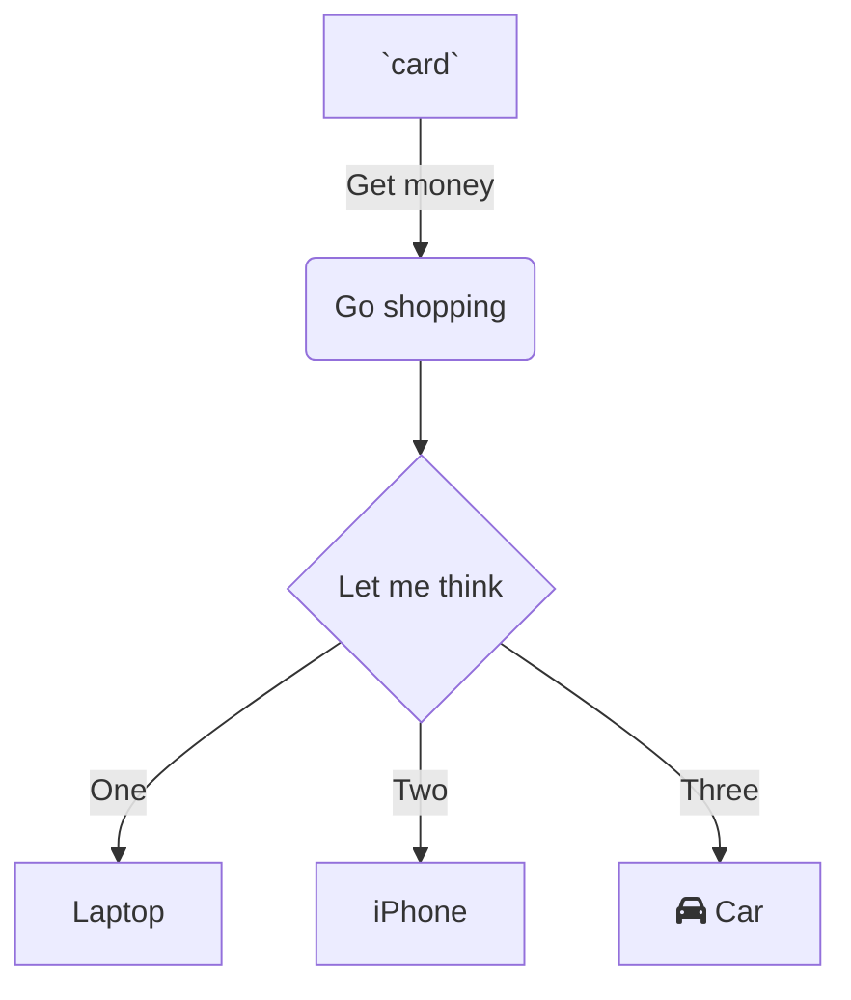

`📄 src/img.js` is under `📄 src`

 

<!--MERMAID {width:100}-->

<!--MCONTENT {content: "graph TD \nA\\[`card`<swm-token data-swm-token=\":src/pass.js:178:25:25:`          value: &quot;This certificate is only valid in combination with the ID card of the certificate holder and expires one year + 14 days after the last dose. The validity of this certificate was not checked by CovidPass.&quot;`\"/>\\] \\-\\-\\>|Get money| B(Go shopping) \nB \\-\\-\\> C{Let me think} \nC \\-\\-\\>|One| D\\[Laptop\\] \nC \\-\\-\\>|Two| E\\[iPhone\\] \nC \\-\\-\\>|Three| F\\[fa:fa-car Car\\] \n\n "} --->

 

 

 

 

This file was generated by Swimm. [Click here to view it in the app](https://swimm-web-app.web.app/repos/Z2l0aHViJTNBJTNBY292aWRwYXNzJTNBJTNBc2h1anV1dQ==/docs/t7fslg8o).
